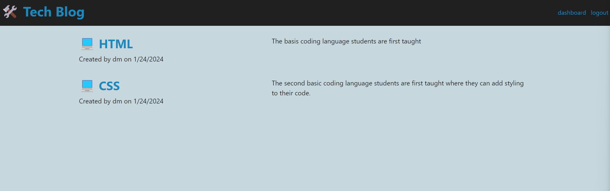
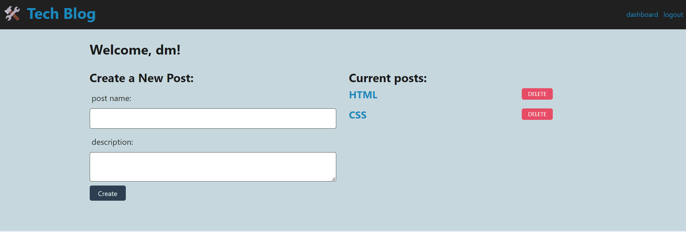
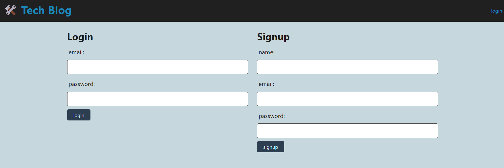
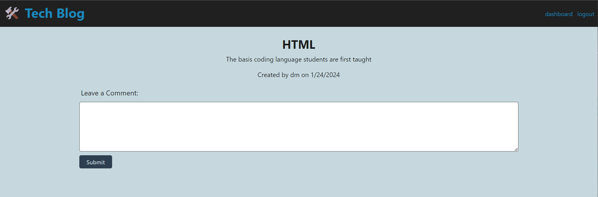

# Tech Blog

Website: https://tech-blog-qlxn.onrender.com/


## Description

This is a personal tech blog forum made for anyone to easily share their own coding journey for others to see! Through this project, I was able to learn how to better route my files and learn how forums work.

## Table of Contents (Optional)

If your README is long, add a table of contents to make it easy for users to find what they need.

- [Installation](#installation)
- [Usage](#usage)
- [Credits](#credits)
- [License](#license)

## Installation

Only installations needed is `npm install` for the node modules. 

## Usage

The image shown is how the site will look when you first sign in. It is also what will display when you click on the title, "Tech Blog".


When you are signed in and click on dashboard, you will be directed to this page shown below where the user can create their posts.



When the user first enter the page and click on login, the page will display the image shown below where the user can sign up or log in if they already have an account.



When the user click on a post, the page will look like the image below where they can view any comments made to the post.



## Credits

N/A

## Codes Used

All codes inspired from module 12.

## License

N/A

## Badges

N/A

## Features

N/A

## How to Contribute

N/A

## Tests

To test, create a dotenv file with these info inputted:
```
DB_NAME='techblog_db'
DB_USER='root'
DB_PASSWORD='your password here'
```

Then create the database by directing into the db file in the command line: `cd db` then type `mysql -u root -p` and input your password.

In mysql, type `source schema.sql` and you should be connected!

After that, direct out of the db file by `cd ..` and type `node server.js` and you can see the site in `localhost:3001`